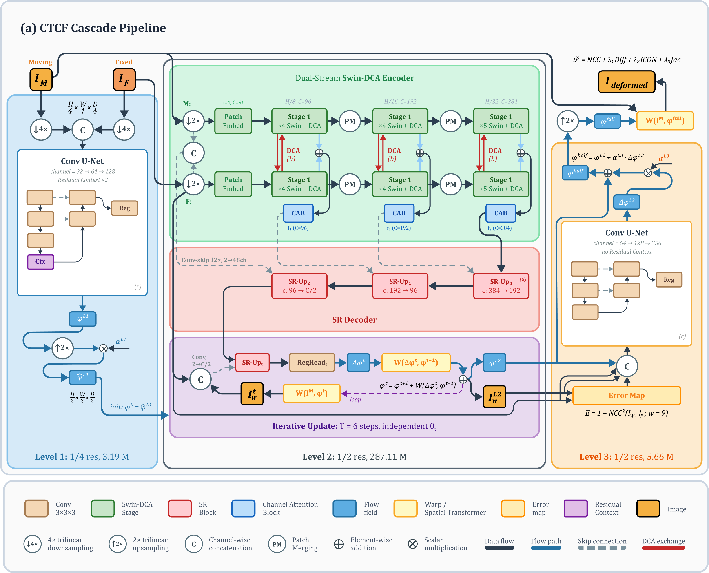
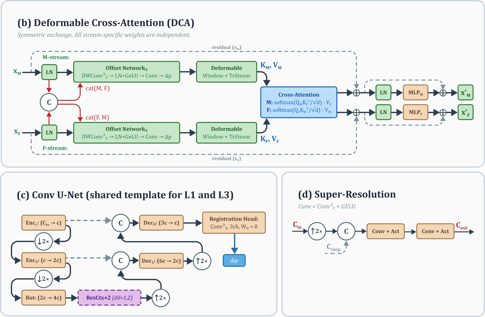
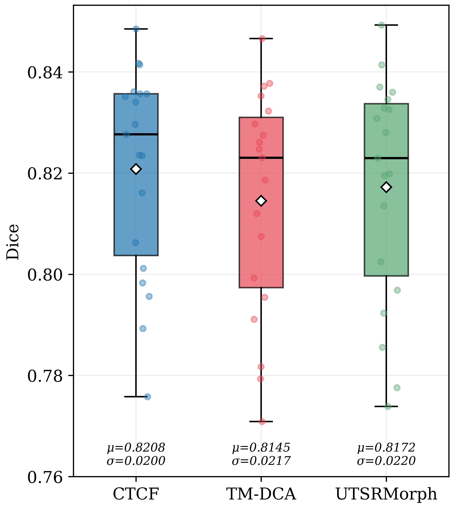
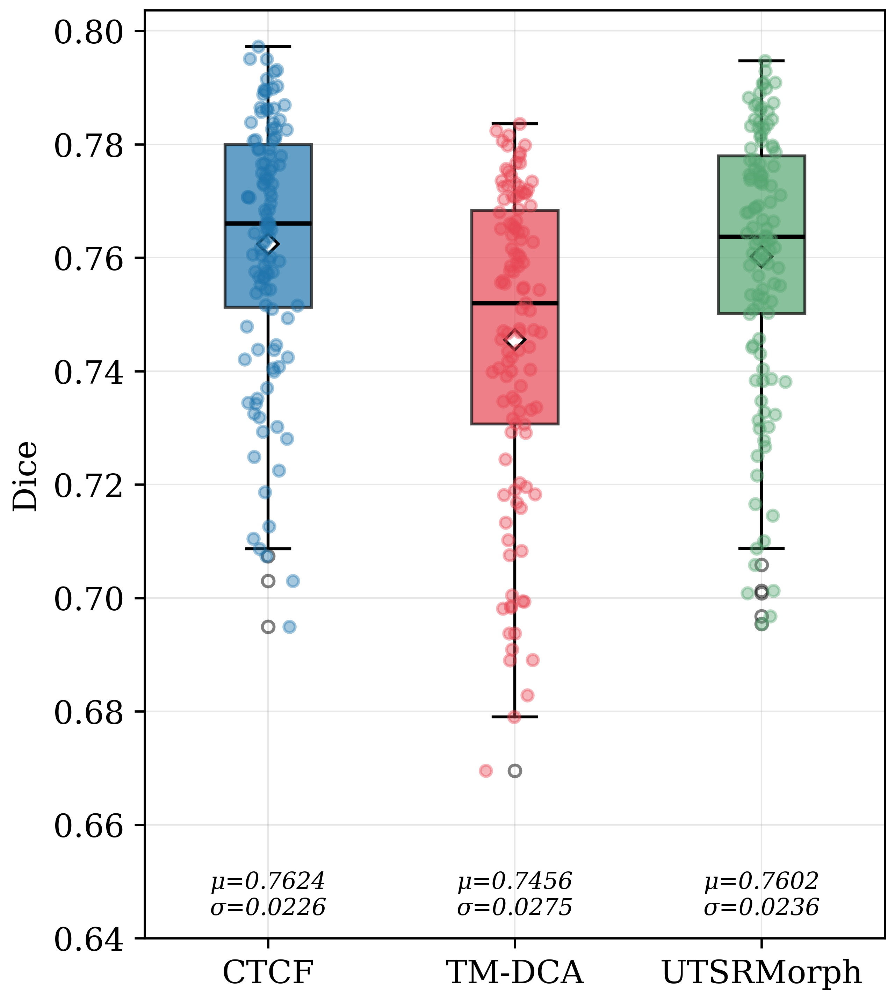

# CTCF: Cascade Transformer for Coarse-to-Fine Unsupervised Medical Image Registration

A three-level coarse-to-fine cascade framework for unsupervised deformable 3D medical image registration.

**Preliminary work:** [CTCF: Cascaded Transformer with Cross-Attention and Super-Resolution for Unsupervised Medical Image Registration](https://doi.org/10.1109/ElCon-CN69892.2026.11414003) — ElCon-CN 2026, pp. 120-127.

## Architecture

CTCF wraps a lightweight coarse-and-refine envelope around an existing single-pass registration backbone (TransMorph-DCA):

- **Level 1** — CoarseFlowNet (3.19M params): convolutional U-Net at 1/4 resolution for global alignment.
- **Level 2** — Swin-DCA + SR decoder (287.11M params): dual-stream Swin Transformer with DCA at 1/2 resolution.
- **Level 3** — FlowRefiner (5.66M params): error-driven convolutional U-Net at 1/2 resolution using NCC error maps.

Total: **295.96M** parameters. Levels 1 and 3 add only **3.0%** overhead over the TransMorph-DCA backbone.

A smoothstep warmup schedule gradually activates the outer cascade levels during training.



<details>
<summary>Building blocks</summary>


</details>

## Results

All models trained **unsupervised** (NCC + regularization, no segmentation labels during training).

### OASIS (19 test pairs)

| Method | Dice | HD95 | SDlogJ | Fold% | Params |
|--------|------|------|--------|-------|--------|
| TransMorph-DCA | 0.8145 | 1.848 | 0.0805 | 0.264 | 283.93M |
| UTSRMorph (Large) | 0.8172 | 1.890 | 0.1015 | 0.890 | 421.50M |
| **CTCF (ours)** | **0.8208** | **1.790** | **0.0797** | 0.523 | 295.96M |

### IXI (115 test subjects)

| Method | Dice | HD95 | SDlogJ | Fold% | Params |
|--------|------|------|--------|-------|--------|
| TransMorph-DCA | 0.7456 | 3.504 | 0.0874 | 1.153 | 283.93M |
| UTSRMorph (IXI-Large) | 0.7602 | 3.012 | 0.0627 | 0.677 | 152.23M |
| **CTCF (ours)** | **0.7624** | **2.843** | **0.0594** | **0.561** | 295.96M |

All Dice improvements are statistically significant (p < 0.001, Wilcoxon signed-rank test).

### Visual Comparison

| OASIS | IXI |
|:-----:|:---:|
|  |  |

### Qualitative Examples

| OASIS | IXI |
|:-----:|:---:|
|  |  |

## Installation

```bash
conda env create -f environment.yml
conda activate ctcf
```

## Quick Start

### Training

```bash
# CTCF (local paths profile --1)
python -m experiments.train_CTCF --ds OASIS --1
python -m experiments.train_CTCF --ds IXI --1

# Baselines
python -m experiments.train_TransMorphDCA --ds OASIS --1
python -m experiments.train_UTSRMorph --ds OASIS --1
```

### Inference

```bash
python -m experiments.inference \
  --model ctcf \
  --ckpt results/CTCF/ckpt/best.pth \
  --ds OASIS --1
```

### Ablation Experiments

All ablation rounds from the paper can be reproduced with a single script:

```bash
# Run a specific round
bash tools/run_ablation.sh R1 --data-dir /data --gpu 0

# Run all rounds sequentially
bash tools/run_ablation.sh all --paths-profile 3
```

Rounds: 
- R1 (loss/strategy),
- R2 (L3 tuning),
- R3 (L1 capacity),
- R4 (cascade decomposition),
- R5 (resolution scaling),
- R6 (capacity ablation).

### Key Training Flags

| Flag | Default | Description |
|------|---------|-------------|
| `--max_epoch` | 500 | Training epochs |
| `--w_reg` | auto | Diffusion regularization weight (IXI=4.0, others=1.0) |
| `--w_icon` | 0.05 | ICON loss weight |
| `--w_jac` | 0.005 | Jacobian penalty weight |
| `--l1_base_ch` | 32 | Level 1 base channels |
| `--l3_base_ch` | 64 | Level 3 base channels |
| `--l3_error_mode` | ncc | Error map: `absdiff`, `gradmag`, or `ncc` |
| `--time_steps` | 6 | L2 integration steps |
| `--1` / `--2` / `--3` | - | Path profile (local/alt/remote) |

## Project Structure

```
models/CTCF/
  model.py          # CTCF_CascadeA: main forward pass, composes L1+L2+L3 flows
  stages.py         # L1 (CoarseFlowNetQuarter), L2 (CTCF_DCA_CoreHalf), L3 (FlowRefiner3D)
  configs.py        # CtcfConfig dataclass
  blocks.py         # Swin Transformer blocks, DCA attention

models/TransMorph_DCA/  # Baseline: TransMorph-DCA
models/UTSRMorph/       # Baseline: UTSRMorph

experiments/
  train_CTCF.py         # CTCF training (Runner class, CLI args)
  train_TransMorphDCA.py
  train_UTSRMorph.py
  inference.py          # Unified inference and evaluation
  core/
    train_runtime.py    # Path profiles, run_train() entry point
    train_rules.py      # Dataset defaults (cascade schedule, hyperparams)
    model_adapters.py   # CLI args -> CtcfConfig bridge

utils/
  losses.py         # NCC, ICON, Jacobian, diffusion regularization
  field.py          # Flow composition, warping, identity grid
  validation.py     # Dice, SDlogJ, fold% evaluation
  spatial.py        # SpatialTransformer

datasets/
  OASIS.py          # OASIS dataloader (414 volumes, 35 regions)
  IXI.py            # IXI dataloader (576 volumes, 30 regions)

tools/
  ablation.sh   # Unified ablation runner (R1-R6)
  count_params.py   # Parameter counting utility
  compute_stats.py          # Statistical tests (Wilcoxon, Hodges-Lehmann)
  paper/            # Figure generation scripts
```

## Notes

- `logs/` and `results/` are not version-controlled.
- Baselines use original authors' codebases with minimal modifications (data loaders and logging only).
- CTCF uses bidirectional training (forward + backward per iteration).

## Citation

```bibtex
@inproceedings{pasenko2026ctcf,
  author    = {Pasenko, Daniil V.},
  title     = {CTCF: Cascaded Transformer with Cross-Attention and Super-Resolution for Unsupervised Medical Image Registration},
  booktitle = {2026 ElCon Conference of Young Researchers (ElCon-CN)},
  pages     = {120--127},
  year      = {2026},
  doi       = {10.1109/ElCon-CN69892.2026.11414003}
}
```
