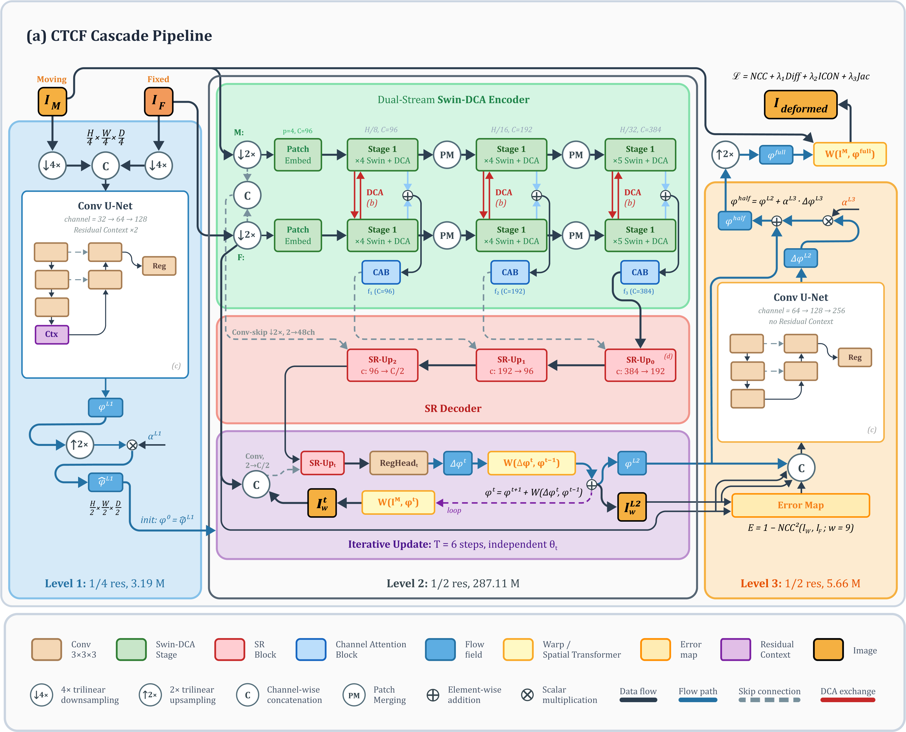
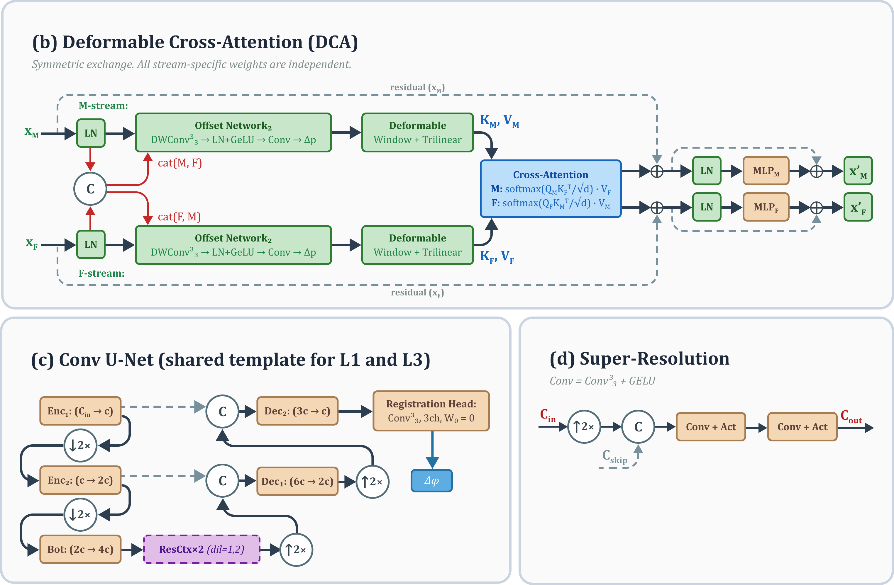
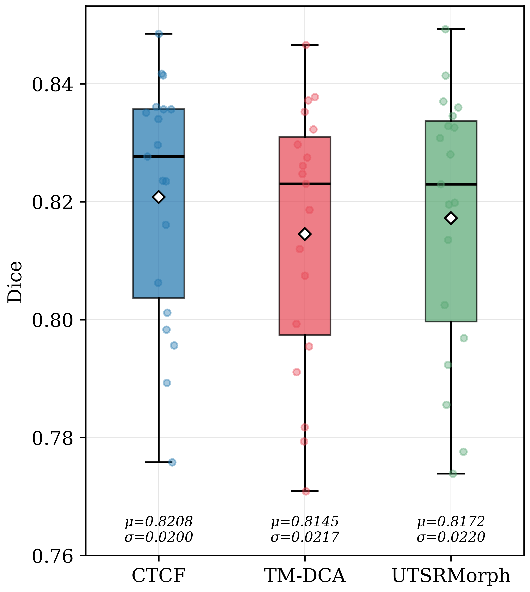
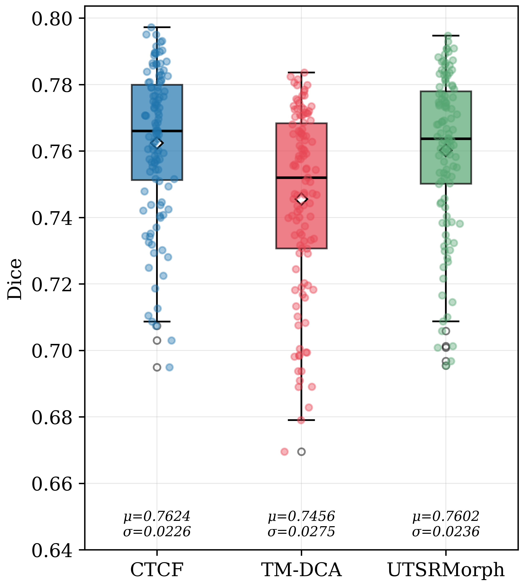

# CTCF: Cascade Transformer for Coarse-to-Fine Unsupervised Medical Image Registration

> **Status (August 2026):** The frozen source snapshot for the published CTCF paper is
> tag **v1.0**. The current tree keeps the paper training and inference entry points while
> adding backbone-pluggable models, exact topology checks, and reusable post-inference
> research utilities. The metrics below refer to the published v1.0 protocol.

A three-level coarse-to-fine cascade framework for unsupervised deformable 3D medical image registration.

**Paper (preprint):** [CTCF: A Three-Level Coarse-to-Fine Cascade for Unsupervised Deformable Medical Image Registration](https://doi.org/10.20944/preprints202604.0580.v1) — Preprints.org, 2026.

**Pretrained checkpoints:** [10.5281/zenodo.19665292](https://doi.org/10.5281/zenodo.19665292) — CTCF and both baselines on OASIS + IXI.

## Architecture

CTCF wraps a lightweight coarse-and-refine envelope around an existing single-pass registration backbone (TransMorph-DCA):

- **Level 1** — CoarseFlowNet (3.19M params): convolutional U-Net at 1/4 resolution for global alignment.
- **Level 2** — Swin-DCA + SR decoder (287.11M params): dual-stream Swin Transformer with DCA at 1/2 resolution.
- **Level 3** — FlowRefiner (5.66M params): error-driven convolutional U-Net at 1/2 resolution using NCC error maps.

Total: **295.96M** parameters. Levels 1 and 3 add only **3.0%** overhead over the TransMorph-DCA backbone.

A smoothstep warmup schedule gradually activates the outer cascade levels during training.



<details>
<summary>Building blocks</summary>


</details>

## Results

All models trained **unsupervised** (NCC + regularization, no segmentation labels during training).

### OASIS (19 test pairs)

| Method | Dice | HD95 | SDlogJ | Fold% | Params |
|--------|------|------|--------|-------|--------|
| TransMorph-DCA | 0.8145 | 1.848 | 0.0805 | 0.264 | 283.93M |
| UTSRMorph (Large) | 0.8172 | 1.890 | 0.1015 | 0.890 | 421.50M |
| **CTCF (ours)** | **0.8208** | **1.790** | **0.0797** | 0.523 | 295.96M |

### IXI (115 test subjects)

| Method | Dice | HD95 | SDlogJ | Fold% | Params |
|--------|------|------|--------|-------|--------|
| TransMorph-DCA | 0.7456 | 3.504 | 0.0874 | 1.153 | 283.93M |
| UTSRMorph (IXI-Large) | 0.7602 | 3.012 | 0.0627 | 0.677 | 152.23M |
| **CTCF (ours)** | **0.7624** | **2.843** | **0.0594** | **0.561** | 295.96M |

All Dice improvements are statistically significant (p < 0.001, Wilcoxon signed-rank test).

### Visual Comparison

| OASIS | IXI |
|:-----:|:---:|
|  |  |

### Qualitative Examples

| OASIS | IXI |
|:-----:|:---:|
|  |  |

## Installation

```bash
conda env create -f environment.yml
conda activate ctcf
```

## Datasets

Both datasets are used in their `.pkl`-format preprocessed versions
redistributed by the [TransMorph project][transmorph-repo]:

- **OASIS** — Learn2Reg 2021 Task 3 preprocessing (skull stripping, bias-field
  correction, affine alignment to MNI 152, FreeSurfer segmentation of 35
  labels). Download via TransMorph's [OASIS page][transmorph-oasis] (~1.3 GB).
- **IXI** — FreeSurfer-segmented T1 volumes (30 anatomical labels) with a
  template atlas from CycleMorph. Redistributed under CC BY-SA 3.0 Unported.
  Download via TransMorph's [IXI page][transmorph-ixi].

Both datasets come preprocessed to 160×192×224.

If you use these data, please cite:

- **OASIS:** Marcus et al., *J. Cogn. Neurosci.* 19:1498–1507 (2007);
  Hoopes et al., *IPMI 2021* (preprocessing / HyperMorph release).
- **IXI:** the IXI consortium at <https://brain-development.org/ixi-dataset/>.
- **TransMorph** (for both `.pkl` distributions): Chen et al., *Med. Image
  Anal.* 82:102615 (2022).
- **CycleMorph** (IXI atlas): Kim et al., *Med. Image Anal.* 71:102036 (2021).

[transmorph-repo]: https://github.com/junyuchen245/TransMorph_Transformer_for_Medical_Image_Registration
[transmorph-oasis]: https://github.com/junyuchen245/TransMorph_Transformer_for_Medical_Image_Registration/blob/main/OASIS/TransMorph_on_OASIS.md
[transmorph-ixi]: https://github.com/junyuchen245/TransMorph_Transformer_for_Medical_Image_Registration/blob/main/IXI/TransMorph_on_IXI.md

## Path Configuration

All training and inference scripts read dataset locations from the `PATHS` dict
in [experiments/core/path_profiles.py](experiments/core/path_profiles.py).
The portable profile `3` derives both dataset trees from `CTCF_DATA_DIR`:

```bash
export CTCF_DATA_DIR=/path/to/data
```

That directory must contain `OASIS_L2R_2021_task03/` and `IXI_data/` with the
subdirectories described above. The commands below use `--3`; alternatively,
add a machine-specific profile in `path_profiles.py` and select it explicitly.

## Pretrained Checkpoints

Pretrained weights for CTCF and both baselines on both datasets are hosted on
Zenodo: **[10.5281/zenodo.19665292](https://doi.org/10.5281/zenodo.19665292)**
(record page: <https://zenodo.org/records/19665292>).

The bundle is split into three archives — one per model family (`CTCF`,
`TM-DCA`, `UTSRMorph`). Download all three and extract them into a common
parent directory; each archive contributes one model subtree to a shared
`Checkpoints/` root, yielding:

```
Checkpoints/
├── CTCF/
│   ├── OASIS/best.pth
│   └── IXI/best.pth
├── TM-DCA/
│   ├── OASIS/best.pth
│   └── IXI/best.pth
└── UTSRMorph/
    ├── OASIS/best.pth
    └── IXI/best.pth
```

All inference commands below assume this layout; if you place `Checkpoints/`
elsewhere, just pass the appropriate path via `--ckpt`.

## Quick Start

### Training

```bash
# CTCF
python -m experiments.train_CTCF --ds OASIS --3
python -m experiments.train_CTCF --ds IXI --3

# Baselines
python -m experiments.train_TransMorphDCA --ds OASIS --3
python -m experiments.train_UTSRMorph --ds OASIS --3
```

### Inference — Reproducing the Paper Metrics

**CTCF (ours):**

```bash
# OASIS — 19 test pairs
python -m experiments.inference --model ctcf \
  --ckpt Checkpoints/CTCF/OASIS/best.pth \
  --ds OASIS --3 --hd95

# IXI — 115 test subjects
python -m experiments.inference --model ctcf \
  --ckpt Checkpoints/CTCF/IXI/best.pth \
  --ds IXI --3 --use_test --hd95
```

**TransMorph-DCA:**

```bash
python -m experiments.inference --model tm-dca \
  --ckpt Checkpoints/TM-DCA/OASIS/best.pth \
  --ds OASIS --3 --hd95

python -m experiments.inference --model tm-dca \
  --ckpt Checkpoints/TM-DCA/IXI/best.pth \
  --ds IXI --3 --use_test --hd95
```

**UTSRMorph** (the config key differs between OASIS and IXI):

```bash
python -m experiments.inference --model utsrmorph \
  --ckpt Checkpoints/UTSRMorph/OASIS/best.pth \
  --ds OASIS --3 --hd95 --utsr_config UTSRMorph-Large

python -m experiments.inference --model utsrmorph \
  --ckpt Checkpoints/UTSRMorph/IXI/best.pth \
  --ds IXI --3 --use_test --hd95 --utsr_config UTSRMorph-IXI-Large
```

Per-case metrics are written to
`results/infer/<DS>/<model>/best/per_case.csv`, and aggregate mean±std to
`summary.json` alongside it.

### Cross-Dataset Zero-Shot (Table 6 in paper)

```bash
CKPT_CTCF_OASIS=Checkpoints/CTCF/OASIS/best.pth \
CKPT_CTCF_IXI=Checkpoints/CTCF/IXI/best.pth \
CKPT_TMDCA_OASIS=Checkpoints/TM-DCA/OASIS/best.pth \
CKPT_TMDCA_IXI=Checkpoints/TM-DCA/IXI/best.pth \
CKPT_UTSR_OASIS=Checkpoints/UTSRMorph/OASIS/best.pth \
CKPT_UTSR_IXI=Checkpoints/UTSRMorph/IXI/best.pth \
bash tools/runners/eval/cross_dataset_inference.sh --paths-profile 3 --gpu 0
```

### Common Inference Flags

| Flag | Purpose |
|------|---------|
| `--ds OASIS` / `--ds IXI` | Dataset selector |
| `--use_test` | IXI only — evaluate on the 115-subject test split instead of the 58-subject val split |
| `--hd95` | Add HD95 to the reported metrics (Dice and SDlogJ / Fold% are always computed) |
| `--utsr_config` | `UTSRMorph-Large` for OASIS, `UTSRMorph-IXI-Large` for IXI |
| `--save_pngs` | Save qualitative preview PNGs |
| `--save_flow` | Save the predicted flow fields as compressed `.npz` |

### Ablation Experiments

The exact R1–R6 orchestration belongs to the frozen `v1.0` paper snapshot and
is intentionally not duplicated in the active runner tree. Use a separate
worktree to reproduce it without replacing the current checkout:

```bash
git worktree add ../CTCF-v1.0 v1.0
cd ../CTCF-v1.0

# Run a specific round
bash tools/ablation.sh R1 --gpu 0

# Run all rounds sequentially
bash tools/ablation.sh all
```

Rounds:
- R1 (loss/strategy),
- R2 (L3 tuning),
- R3 (L1 capacity),
- R4 (cascade decomposition),
- R5 (resolution scaling),
- R6 (capacity ablation).

### Key Training Flags

| Flag | Default | Description |
|------|---------|-------------|
| `--max_epoch` | 500 | Training epochs |
| `--w_reg` | auto | Diffusion regularization weight (IXI=4.0, others=1.0) |
| `--w_icon` | 0.05 | ICON loss weight |
| `--w_jac` | 0.005 | Jacobian penalty weight |
| `--l1_base_ch` | 32 | Level 1 base channels |
| `--l3_base_ch` | 64 | Level 3 base channels |
| `--l3_error_mode` | ncc | Error map: `absdiff`, `gradmag`, or `ncc` |
| `--time_steps` | 6 | L2 integration steps |

## Certified Search Research Utilities

The completed C0–C7 inference-gate producers are no longer duplicated in the
active tree. Their exact source revisions remain available through Git, and
the read-only registry records the corresponding commits and compact result
products. The reusable numerical core lives in `tools.analysis.search`:

- `transaction` — materialization, exact checks, acceptance, and byte-exact rollback;
- `cost_volume`, `multiscale`, `intensity`, `pyramid`, and `learned` — reusable proposal primitives;
- `metrics` — explicitly identified geometry metrics;
- `history` — the standard-library-only registry verifier.

If the compact historical products are present under `results/`, verify all
known C0–C7/NUMSTAB products with:

```bash
python -m tools.analysis.search.history verify-known --results-root results
```

## Project Structure

```
models/CTCF/
  model.py          # CTCF_CascadeA: main forward pass, composes L1+L2+L3 flows
  stages.py         # L1 (CoarseFlowNetQuarter), L2 (CTCF_DCA_CoreHalf), L3 (FlowRefiner3D)
  configs.py        # CtcfConfig dataclass
  blocks.py         # Swin Transformer blocks, DCA attention

models/TransMorph_DCA/  # Published baseline: TransMorph-DCA
models/UTSRMorph/       # Published baseline: UTSRMorph
models/{VoxelMorph,LKUNet,MambaMorph,VMambaMorph,EfficientMorph}/
                        # Pluggable registration backbones

experiments/
  train_*.py            # CTCF, baseline, and pluggable-backbone training entry points
  inference.py          # Unified inference and evaluation
  core/
    path_profiles.py    # Explicit local/remote dataset profiles
    train_runtime.py    # Shared training runtime
    inference_runtime.py
    model_adapters.py   # CLI args -> CtcfConfig bridge

utils/
  losses.py         # NCC, ICON, Jacobian, diffusion regularization
  field.py          # Flow composition, warping, identity grid
  validation.py     # Dice, SDlogJ, fold% evaluation
  spatial.py        # SpatialTransformer

datasets/
  OASIS.py          # OASIS dataloader (414 volumes, 35 regions)
  IXI.py            # IXI dataloader (576 volumes, 30 regions)

tools/
  analysis/
    search/          # Reusable certified-search core and historical verifier
    tests/search/    # Search-core and registry contracts
    compute_stats.py # Statistical tests (Wilcoxon, Hodges-Lehmann)
    model_complexity.py
  runners/
    train/           # Active training protocols
    eval/            # Evaluation and checkpoint validation
    topology/        # Exact-certificate and repair studies
    archive/         # Historical runner scripts retained as code provenance
  dev/               # Repository quality and invariant checks
  paper/             # Figure and table generation scripts
```

## Notes

- `logs/` and `results/` are not version-controlled.
- Baselines use original authors' codebases with minimal modifications (data loaders and logging only).
- CTCF uses bidirectional training (forward + backward per iteration).

## Citation

Main paper (preprint):

```bibtex
@article{pasenko2026ctcf,
  author  = {Pasenko, Daniil V. and Davydov, Roman},
  title   = {{CTCF}: A Three-Level Coarse-to-Fine Cascade for Unsupervised Deformable Medical Image Registration},
  journal = {Preprints},
  year    = {2026},
  doi     = {10.20944/preprints202604.0580.v1}
}
```

Earlier conference version (ElCon-CN 2026):

```bibtex
@inproceedings{pasenko2026ctcf_elcon,
  author    = {Pasenko, Daniil V.},
  title     = {{CTCF}: Cascaded Transformer with Cross-Attention and Super-Resolution for Unsupervised Medical Image Registration},
  booktitle = {2026 ElCon Conference of Young Researchers (ElCon-CN)},
  pages     = {120--127},
  year      = {2026},
  doi       = {10.1109/ElCon-CN69892.2026.11414003}
}
```
